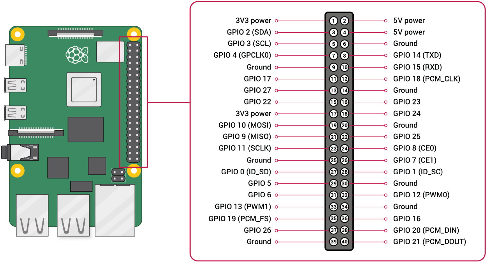
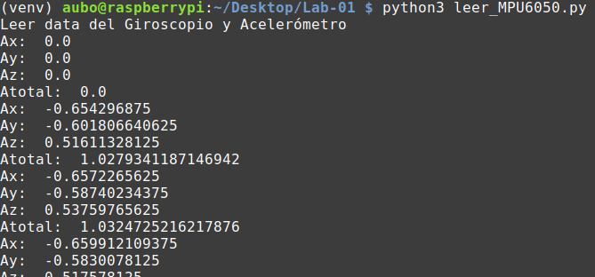
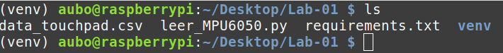

## **Parte 01: Captura de los datos del MPU6050 con el Raspberry Pi 4**

- Debemos activar en la "**Raspberry**" la comunicación por SSH.
- Nos conectamos a la "**Raspberry**" a través de SSH.
- Abrimos la terminal de la "**Raspberry**".
- Vamos al escritorio.
>`cd ~/Desktop`
- Creamos una nueva carpeta y vamos a ella.
>`mkdir Parte-01`

>`cd Parte-01`
- Descargamos los archivos.
>`curl -O https://iot-lab-bucket.s3.amazonaws.com/unamad_mayo_lab01_parte01/leer_MPU6050.py`

>`curl -O https://iot-lab-bucket.s3.amazonaws.com/unamad_mayo_lab01_parte01/requirements.txt`
- Creamos el entorno virtual.
>`python3 -m venv venv`
- Activamos el entorno virtual.
>`source venv/bin/activate`
- Instalamos los paquetes de Python.
>`pip install -r requirements.txt`
- Habilitamos la comunicación I2C.
>`sudo raspi-config`
- Interface Options => I2C => Yes
- Ejecutamos el programa.
>`python3 leer_MPU6050.py`
- Se verá en la pantalla los valores de aceleración lineal en m/s2.

- Así mismo, se guarda en un archivo CSV los valores de aceleración para su posterior análisis.

