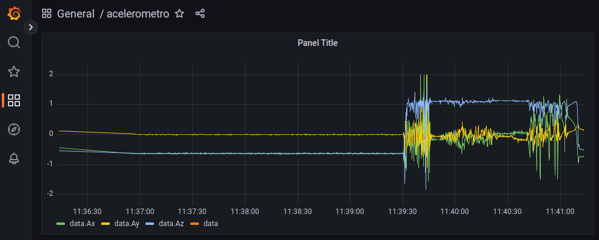

## **Parte 02: Almacenamiento y Visualización de la data con Mosquitto, Node-RED, InfluxDB y Grafana**

- Desactivamos el entorno virtual.
>`deactivate`
- Vamos al escritorio.
>`cd ~/Desktop`
- Creamos una nueva carpeta y vamos a ella.
>`mkdir Parte-02`

>`cd Parte-02`
- Descargamos los archivos.
>`curl -O https://iot-lab-bucket.s3.amazonaws.com/unamad_mayo_lab01_parte02/nodered.sh`

>`curl -O https://iot-lab-bucket.s3.amazonaws.com/unamad_mayo_lab01_parte02/influxdb.sh`

>`curl -O https://iot-lab-bucket.s3.amazonaws.com/unamad_mayo_lab01_parte02/grafana.sh`

>`curl -O https://iot-lab-bucket.s3.amazonaws.com/unamad_mayo_lab01_parte02/enviar_MPU6050.py`

>`curl -O https://iot-lab-bucket.s3.amazonaws.com/unamad_mayo_lab01_parte02/requirements.txt`

### **2.1 Instalación del Broker MQTT Mosquitto:**
- Ejecutar el siguiente comando para instalar Mosquitto.
>`sudo apt install mosquitto mosquitto-clients -y`

### **2.2 Instalación de Node-RED**
- Instalación de **Node-RED**.
- https://nodered.org/docs/getting-started/raspberrypi
- Ejecutamos el script **nodered.sh**
>`sh nodered.sh`
- Ingresar a Node-RED para validar que está funcionando desde el navegador de nuestra PC.
>`http://<direccion_IP_local_RPI>:1880`

- Abrimos otra pestaña para seguir con la instalación de otros paquetes.
- Si se cierra o quieres iniciar nuevamente "**Node_RED**" ejecuta:
>`node-red-start`

- Si queremos que "**Node-RED**" se inicialice cada vez que se encienda la "**Raspberry**", ejecuta:
>`sudo systemctl enable nodered.service`

### **2.3 Instalación de InfluxDB**
- https://linuxhint.com/install-influxdb-raspberry-pi/
- Ejecutamos el script **influxdb.sh**
>`sh influxdb.sh`
- El archivo de configuración de InfluxDB se puede ver con el siguiente comando:
>`sudo cat /etc/influxdb/influxdb.conf`
- Ejecutamos el siguiente comando:
>`influx -host localhost`

### **2.4 Instalación de Grafana:**
- https://grafana.com/tutorials/install-grafana-on-raspberry-pi/
- Ejecutamos el script **grafana.sh**
>`sh grafana.sh`
- Ingresamos a Grafana desde el navegador de nuestra PC:
>`http://<direccion_IP_local_RPI>:3000`
- Nos logueamos:
>`Usuario: admin`

>`Password: admin`
- Cambiamos la contraseña por defecto.

### **2.5 Validación del funcionamiento del Broker Mosquitto:**
- En nuestra terminal ejecutar este comando para suscribirnos a todos los tópicos y escuchar los mensajes que se envíen:
>`mosquitto_sub -v -t "#"`
- Abrimos otra pestaña de nuestra terminal y publicamos a un tópico "data" el mensaje "hola":
>`mosquitto_pub -t data -m "hola"`
- Deberíamos ver el tópico y el mensaje que se publicó en la terminal donde se está ejecutando el suscriptor.
>`(Ejemplo) data hola`
- Si funciona, quiere decir que el Broker de Mosquitto está funcionando correctamente.

### **2.6 Conexión del Broker Mosquitto y Node-RED:**
- Ingresar a Node-RED desde el navegador de nuestra PC.
>`http://<direccion_IP_local_RPI>:1880`
- Vamos a la parte izquierda de Node-RED, en **network** ubicamos el elemento **mqtt in** y lo arrastramos a la pantalla principal.
- Le hacemos doble click, y editamos sus propiedades:
    - **Server:** en "**Name**" colocamos el nombre y en "**Server**" ponemos "**localhost**".
    - **Action**: Subscribe to single topic
    - **Topic**: data

- Podemos conectarlo con el elemento **debug** para ver la recepción de los mensajes.
- Presionar el botón **Deploy**.

### **2.7 Conexión de Node-RED e InfluxDB:**
- Ejecutar InfluxDB en la RPI:
>`influx`
- Creamos la BBDD en InfluxDB:
>`create database <nombre_bbdd>`

>`(Ejemplo) create database iot`
- Seteamos el uso de esta BBDD recién creada:
>`use <nombre_bbdd>`

>`(Ejemplo) use iot`

- Creamos usuario con contraseña y con todos los privilegios:
>`create user <nombre_usuario> with password '<password>' with all privileges`

>`(Ejemplo) create user alvaro with password 'martin' with all privileges`

- Damos todos los permisos:
>`grant all privileges on <nombre_bbdd> to <nombre_usuario>`

>`(Ejemplo) grant all privileges on iot to alvaro`

- Salimos:
>`exit`

- Regresamos a **Node-RED**.
- Añadimos la extensión de InfluxDB en Node-RED
    - Ir al botón tipo hamburguesa.
    - Click en **Manage palette**.
    - Click en **Install**.
    - Buscar **node-red-contrib-influxdb** y click en **install**.

- La extensión instalada se verá en **storage**.
- Arrastrar el elemento **influxdb out** y conectarlo con nuestro **mqtt in** anterior.

- Doble click para configurarlo, y editamos su properties:
    - **Name**: nombre del elemento.
    - **Server**: colocamos un nombre, versión 1.8-flux, colocamos la dirección IP local de la RPI con el puerto 8086, y añadimos el usuario y contraseña de InfluxDB que configuramos anteriormente.
    - **Database**: colocamos el nombre de la base de datos que creamos con InfluxDB previamente.
    - **Measurement:** colocamos el nombre del campo con el que se guardará en InfluxDB.

    
- Arrastramos el elemento **parser json**, y lo configuramos con el **Action** llamado **Always convert to JavaScript Object**.

- Conectamos nuestros elementos.

- Para probar que está guardando en nuestra base de datos de InfluxDB, hacemos lo siguiente (en nuestra terminal):
- Enviar data en formato JSON a nuestro Broker Mosquitto utilizando el cliente:

>`mosquitto_pub -t data -m '{"Ax": 24.32, "Ay": 12.12, "Az": 9.32}'`

- Luego desde nuestra terminal, usamos InfluxDB para hacer un querie a la base de datos.

>`influx`

>`use <nombre_bbdd>`

>`(Ejemplo) use iot`

>`show measurements`

>`select * from "data"`

- Con esto hemos validado la conexión entre el Broker MQTT, Node-RED e InfluxDB y que finalmente ya estamos almacenando la data en nuestra base de datos.

### **2.8 Conexión de InfluxDB y Grafana:**
- Vamos a Grafana desde el navegador de nuestra PC.
>`http://<direccion_IP_local_RPI>:3000`
- Click en **Add your first data source**.
- Seleccionar **InfluxDB**.
- **Name**: colocar un nombre.
- **HTTP URL**: colocar la dirección localhost y el puerto en el que funciona InfluxDB.
>`http://localhost:8086`
- **Database:** colocar el nombre de nuestra base de datos.
- **User:** colocar el nombre de usuario que creamos para nuestra base de datos.
- **Password:** colocar la contraseña que creamos para nuestro usuario.
- Click en **Save & Test**.

- Vamos a **+ New Dasboard**.
- Seleccionamos **+ Add visualization**.

- Hacemos click en el lapicito de editar y colocamos el siguiente query:
>`select * from "data"`
- Click en **Apply**.

- Luego click en **save dashboard**.

### **2.9 Envío de la data del acelerómetro al Broker Mosquitto**
- Vamos a nuestra carpeta.
>`cd ~/Desktop/Parte-02`
- Creamos el entorno virtual.
>`python3 -m venv venv`
- Activamos el entorno virtual.
>`source venv/bin/activate`
- Instalamos los paquetes de Python.
>`pip install -r requirements.txt`
- Ejecutamos el programa.
>`python3 enviar_MPU6050.py`
- Se verá en la pantalla los valores de aceleración lineal en m/s2.
- Si vamos a Grafana, se debería ver la data graficada de las 3 aceleraciones lineales Ax, Ay, Az.

- Si vamos a Node-RED, se debería ver algo así:

