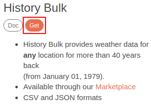
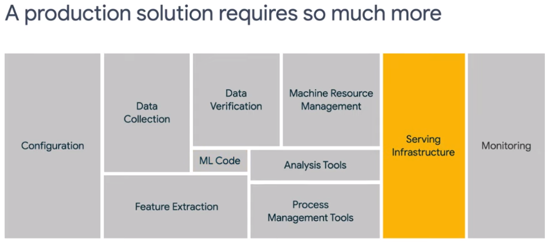
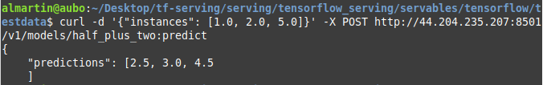

# **LABORATORIO N° 4: Desarrollo y puesta en servicio de un modelo de Machine Learning para el pronóstico de la Temperatura del Día Siguiente**

## **Paso 01: Descargar los datos Atmosféricos de OpenWeather API**
- Ir a la página de OpenWeather API: `https://openweathermap.org/`
- Hacer click en la pestaña **API**: `https://openweathermap.org/api`
- Ir a la sección **Historical weather data collection**.
- Hacer click en **Get** en la sección **History Bulk**.

- Esto nos redirigirá a la siguiente página, luego en el mapa seleccionamos la localización de la cuál se quiere obtener el histórico de datos.

- En parámetros meteorológicos seleccionamos **All**, en Units **Metric**, en File Format **CSV**, y seleccionamos el rango de las fechas que se extraerán.

- Luego click en **Place Order**.
- Les pedirá los datos personales y de su tarjeta para realizar, así como un correo para enviar el archivo CSV.
- El pago es de 7 libras esterlinas.

- En menos de una hora, la información llegará a su correo.

- Revisar el correo.

## **Paso 02: Pre-procesamiento de los Datos y Creación del Modelo de ML**
- Abrir "**Google Drive**" con cuenta normal.
- Crear una carpeta en "**Drive**" llamada "**Lab04**".
- Subir los siguientes archivos:
>`https://iot-lab-bucket.s3.amazonaws.com/unamad_mayo_lab04/notebooks/01-Lab-04+ML-Model-Forecast-Weather.ipynb`

>`https://iot-lab-bucket.s3.amazonaws.com/unamad_mayo_lab04/notebooks/02-Lab-04+ML-Model-Forecast-Weather.ipynb`

>`https://iot-lab-bucket.s3.amazonaws.com/unamad_mayo_lab04/notebooks/03-Lab-04+ML-Model-Forecast-Weather.ipynb`

>`https://iot-lab-bucket.s3.amazonaws.com/unamad_mayo_lab04/UNAMAD_weather.csv`

- Los pasos están contenidos en los "**notebooks**", donde se procesará y analizará el histórico de parámetros climáticos de más de 40 años de la "**UNAMAD**", y se creará un modelo de ML para pronosticar la temperatura del día siguiente.

- Los datasets intermedios se pueden decargar aquí:
>`https://iot-lab-bucket.s3.amazonaws.com/unamad_mayo_lab04/datasets/dataset_x_testing.npy`

>`https://iot-lab-bucket.s3.amazonaws.com/unamad_mayo_lab04/datasets/dataset_x_training.npy`

>`https://iot-lab-bucket.s3.amazonaws.com/unamad_mayo_lab04/datasets/dataset_x_validation.npy`

>`https://iot-lab-bucket.s3.amazonaws.com/unamad_mayo_lab04/datasets/dataset_y_testing.npy`

>`https://iot-lab-bucket.s3.amazonaws.com/unamad_mayo_lab04/datasets/dataset_y_training.npy`

>`https://iot-lab-bucket.s3.amazonaws.com/unamad_mayo_lab04/datasets/dataset_y_validation.npy`

>`https://iot-lab-bucket.s3.amazonaws.com/unamad_mayo_lab04/datasets/df_features_reduced.parquet`

>`https://iot-lab-bucket.s3.amazonaws.com/unamad_mayo_lab04/datasets/merged_df_final.csv`

>`https://iot-lab-bucket.s3.amazonaws.com/unamad_mayo_lab04/datasets/UNAMAD_df_features_selected.parquet`

>`https://iot-lab-bucket.s3.amazonaws.com/unamad_mayo_lab04/datasets/UNAMAD_temp_df_features_raw.parquet`

>`https://iot-lab-bucket.s3.amazonaws.com/unamad_mayo_lab04/datasets/UNAMAD_weather_cleaned.parquet`

>`https://iot-lab-bucket.s3.amazonaws.com/unamad_mayo_lab04/datasets/UNAMAD_weather_pca.parquet`

## **Paso 03: Despliegue del modelo de ML en una EC2 utilizando TensorFlow Serving**

- Esquema de entrenamiento y servicio de un modelo de ML.

- Visión completa de un proyecto de ML.

- ¿Qué es servir un modelo de ML?

- Características de TensorFlow Serving.
    - Baja Latencia.
    - Múltiples modelos en un solo proceso.
    - Múltiples versiones de un modelo cargados en el tiempo.
    - Soporta REST (Representational State Transfer) en el puerto 8501.
    - Soporta gRPC (Remote Procedure Protocol) en el puerto 8500.
    - Tiene soporte para aceleradores (GPU).
    - Puede escalar a demanda con Docker y Kubernetes.
    - Funciona bien para modelos grandes hasta 2 GB.

- REST vs gRPC.

- Flujo de Trabajo para servir el modelo de ML.
    - El modelo debe ser exportado utilizando TensorFlow 2.0 Export.
    - Modelo es exportado como Protobuf (model.pb), con variables y checkpoints, así como archivos adicionales.

- Se puede desplegar TensorFlow Serving utilizando una imagen de Docker o un binario, en este caso utilizaremos Docker.

### **Paso 3.1: Creamos la Máquina Virtual**
- Vamos a la consola de AWS.
>https://console.aws.amazon.com/

- Vamos a "**EC2**" > "**Instances**" > "**Intances**" > "**Launch instances**".
- Colocamos un nombre a la instancia.
- Seleccionamos la "**Amazon Linux 2 AMI**".
- En "Instance type" seleccionamos "**t2.micro**".
- Click en "**Create new key pair**", colocamos un nombre, y click en "**Create key pair**".
- Click en **Launch instance**.
- El estado de la instancia estará en "**Pending**" y luego pasará a "**Running**".
- Vamos a "**Security**" y hacemos click en "**Security groups**".
- En "**Inbound rules**" hacemos click en "**Edit inbound rules**".
- Hacemos click en "**Add rule**" y añadimos la siguiente regla:
    - "**Custom TCP**", Puerto: "**8501**", Fuente: "**0.0.0.0/0**".
    - De este modo podemos hacer solicitudes al modelo mediante un cliente HTTP.
- Regresamos a "**Instances**", seleccionamos nuestra instancia y hacemos click en "**Connect**".
- Hacemos click en "**SSH client**". Seguimos las instrucciones para conectarnos por SSH a nuestra instancia, se puede utilizar PuTTy.

### **Paso 3.2: Instalamos Docker**
- Una vez que estemos en nuestra "**EC2**", creamos una carpeta.
>`mkdir tf-serving-unamad`

>`cd tf-serving-unamad`

- Escribe los siguientes comandos para instalar "**Docker**".
>`sudo yum update -y`

>`sudo yum install -y docker`

>`sudo service docker start`

>`sudo usermod -a -G docker ec2-user`

>`docker --version`

### **Paso 3.3: Instalamos Git**
>`sudo yum install -y git`

### **Paso 3.4: Instalamos e inicializamos TensorFlow Serving con un modelo Básico**
- Descargamos la imagen de Docker de TensorFlow Serving.
>`sudo docker pull tensorflow/serving`

- Descargamos el respositorio de TensorFlow serving
>`git clone https://github.com/tensorflow/serving`

- Creamos esta variable de entorno para localizar el modelo.
>`TESTDATA="$(pwd)/serving/tensorflow_serving/servables/tensorflow/testdata"`

- Vamos a ejecutar el contenedor y a utilizar un modelo de ejemplo.
>`sudo docker run -t --rm -p 8501:8501 -v "$TESTDATA/saved_model_half_plus_two_cpu:/models/half_plus_two" -e MODEL_NAME=half_plus_two tensorflow/serving &`

- Regresamos a "**Instances**", hacemos click en nuestra instancia y en "**Details**" se observará la dirección IPv4 pública de nuestra instancia.

- Descargamos curl (client URL en nuestra PC).
- Realizamos el siguiente POST.
>`curl -d '{"instances": [1.0, 2.0, 5.0]}' -X POST http:IP_v4:8501/v1/models/half_plus_two:predict`

- Como se observa este modelo retorna la mitad más 2 de los números que se ingresan.

- Para ver el ID del contenedor que está ejecutándose.
>`sudo docker ps`

- Para "matar" el contenedor.
>`sudo docker kill ID_CONTENEDOR`

### **Paso 3.5: TensorFlow Serving con nuestro modelo**
- "Matamos el contenedor".
- Estando dentro de la carpeta que creamos "**tf-serving-unamad**" ejecutamos esto:
>`cd serving/tensorflow_serving/servables/tensorflow/testdata`

- Creamos la carpeta que contiene nuestro modelo.
>`mkdir model_unamad_tf`

- Vamos a esa carpeta y creamos otra.
>`cd model_unamad_tf`

>`mkdir 00000123`

>`cd 00000123`

- Descargamos los siguientes archivos.
>`curl -O https://iot-lab-bucket.s3.amazonaws.com/unamad_mayo_lab04/model_unamad_tf/fingerprint.pb`

>`curl -O https://iot-lab-bucket.s3.amazonaws.com/unamad_mayo_lab04/model_unamad_tf/keras_metadata.pb`

>`curl -O https://iot-lab-bucket.s3.amazonaws.com/unamad_mayo_lab04/model_unamad_tf/saved_model.pb`

- Creamos la siguiente carpeta.
>`mkdir variables`

>`mkdir assets`

>`cd variables`

- Descargamos los siguientes archivos.
>`curl -O https://iot-lab-bucket.s3.amazonaws.com/unamad_mayo_lab04/model_unamad_tf/variables/variables.data-00000-of-00001`

>`curl -O https://iot-lab-bucket.s3.amazonaws.com/unamad_mayo_lab04/model_unamad_tf/variables/variables.index`

- La estructura de la carpeta debe verse así.

- Básicamente la carpeta donde se guarda nuestro modelo de TensorFlow, los archivos que se encuentran dentro de esta como "fingerprint.pb", "keras_metadata.pb", "saved_model.pb" y la carpeta "variables" tenemos que guardalo dentro de otra carpeta para que funcione, de este modo podemos guardar otros modelos ahí mismo pero con nombres de carpeta distintos.

- Una vez listo esto, tenemos que ejecutar nuevamente nuestro contenedor de Docker apuntando a este nuevo modelo.

- A veces se puede desconectar la conexión a la instancia, asegurense de que la variable de entorno esté declarada $TESTDATA.

- Regresamos a nuestra carpeta inicial, y nos ubicamos ahí "tf-serving-unamad".
>`sudo docker run -t --rm -p 8501:8501 -v "$TESTDATA/model_unamad_tf:/models/model_unamad_tf" -e MODEL_NAME=model_unamad_tf tensorflow/serving &`

- Ahora procedemos a pasar nuestros 106 features al modelo, estos los obtenemos del dataset de testing, los pasamos a lista y lo copiamos, colocar la IPv4 de tu instancia.

>`curl  -X POST -d '{"instances": [[-0.11035960049539265, 1.1256129356339521, 0.8747456566226414, -0.0012423164516136953, -0.4463157589516969, 2.3073570186728585, 0.5914573631628408, 0.46988231428588373, -0.6527617952812793, -0.5692931655389095, 2.6277334367455003, -0.47392158705057735, -0.5577814360113713, -2.3152131246075167, -0.027509372869247532, 0.6290606053590696, -0.6033600410795388, 1.500783329244639, 0.6497362488081999, 1.4828407841303235, 0.9909442159927861, 0.825745045434795, -1.5691250219295092, 0.6856090336607534, 0.21583367152280353, 1.4134657653649407, 0.23502727869589835, 1.5555383497613504, -0.39656500305093273, -0.3506993636819942, -0.8275101432729017, -0.45522069090422196, 0.42414332676147404, 0.33388779473459135, 0.48275770544700214, -0.9080601673739767, 0.6987589525149489, -0.20389603242214005, 0.4271944201801318, 1.5337079587809224, 0.8775468215808204, 1.307139105765918, -0.9082057748909088, 0.6348613994536441, 0.15862632859652298, -0.07946415995746292, -0.6982379579591997, -0.11780429685051591, -1.7837855094701922, -0.37916657764970885, -0.4021695370424148, 0.8885489592432189, 1.1660522302142973, 2.275751142744675, 0.1907992416332033, 0.05037303596988427, -1.2529225270299458, 1.7250505903630875, -0.37112360419853124, -0.46467229083848105, -2.358987284677759, 0.333450090952478, 0.9827186368485373, 0.11202265789979711, -0.23419114691740525, -0.37086160695568476, 1.932813645867831, -0.7116762654102824, 2.3116153006540316, -1.7209056291240494, -0.6248333022946667, -0.6010890797163493, -0.5560840155238524, 0.9382631975789401, 0.5108963710746722, -0.8725948707336068, -0.7721885314507463, 0.10923156243908477, -0.5087457129673536, 1.0404919765582554, -0.44101823981539134, 0.09285421959841228, -0.11714142480995683, -0.2656464856124545, -0.737206341155974, -2.00189686587344, 0.5709158530854441, 0.20527651035255326, 0.21976485729287168, -0.67352498069471, -0.06880505617199385, -0.6853579434307115, 0.08531476121691618, -0.228728965184175, -1.5507793029841275, -0.4358983750512746, 0.4654150669969006, 1.078209198617307, 1.3820953870100148, -0.5769432572212323, 0.581536821279122, -0.056975370106458256, -0.11703908361709708, -0.18669620834927844, 0.21999337538695266, -0.4176679830048912]]}'  http://IP_v4:8501/v1/models/model_unamad_tf:predict`

- No te olvides de eliminar tu instancia de EC2.